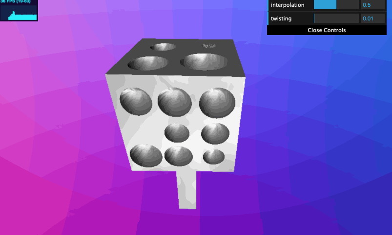
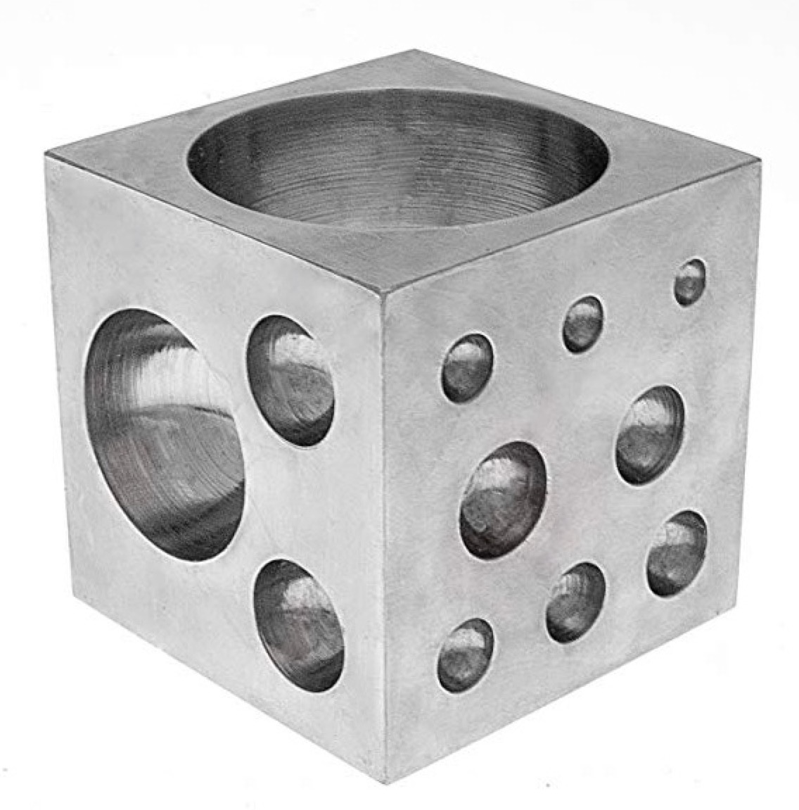

# WebGL Ray-Marching

This project renders a SDF-constructed scene using ray marching techniques.

**University of Pennsylvania, CIS 566 Procedrual Graphics, WebGL Ray-Marching**

* Zichuan Yu
  * [LinkedIn](https://www.linkedin.com/in/zichuan-yu/), [Behance](https://www.behance.net/zainyu717ebcc)
* Tested on: Macbook Pro macOS High Sierra Version 10.13.6 (17G66), i7-4870HQ @ 2.50GHz 16GB, AMD Radeon R9 M370X 2048 MB, Intel Iris Pro 1536 MB

## Results

### [Demo]()

## Inspiration

## Credits

* [IQ](http://www.iquilezles.org/)